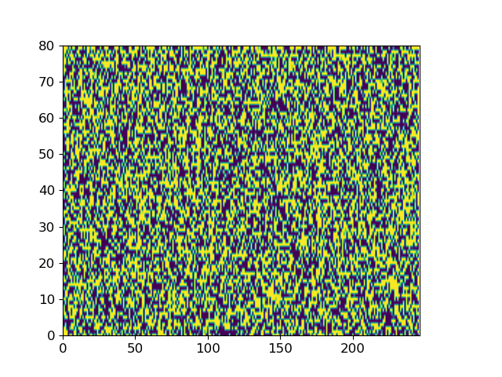
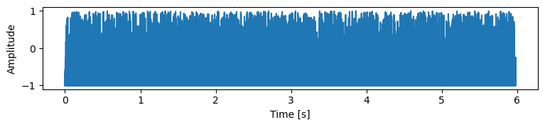

This DEMO introduces ItoTTS and ItoWave, a new generation of speech synthesis technology based on Ito stochastic differential equations.

### Overview
ItoTTS and ItoWave are designed to solve the problem of generating speech from text. We propose to use the linear Ito stochastic differential equation, under conditional input, such as original text or original sound features (such as speech mel spectrum), to use the Wiener process as a drive to gradually subtract the excess signal from the noise signal, thereby generating realistic corresponding meaningful speech. This process is a lot like Auguste Rodin carved out the thinker from the original natural stone, using carving techniques and methods to gradually remove the superfluous parts from the natural stone. Our method unifies two important aspects in speech synthesis, namely text-to-speech (TTS) and vocoder (vocoder), in one framework, which we call ItoTTS and ItoWave, respectively. This unified framework consists of two stochastic processes with solutions determined by the linear Ito stochastic differential equation and its corresponding reverse-time Ito stochastic differential equation, respectively. These two stochastic processes, especially the reverse stochastic process, can generate mel features (ItoTTS) under the condition of text input; or generate corresponding continuous sounds (ItoWave) under the condition of mel features. The experimental results show that our subjective audience MOS score reaches the highest level in the world.

### The key module: Score predictor

There are two key modules of our ItoTTS and ItoWave, one is a deep neural network for predicting the log speech probability density gradient value, and the other is a sampling algorithm based on the gradient value and the inverse Ito stochastic differential equation.

Deep Neural Networks for Predicting Log Speech Probability Density Gradient Values

Predictive network structure in ItoTTS

<td></td>

Prediction network structure in ItoWave

<td></td>

### Audio samples

#### Short samples
You can listen to some sound samples synthesized by ItoTTS and ItoWave. The corresponding text is as follows:

1. but they proceeded in all seriousness, and would have shrunk from no outrage or atrocity in furtherance of their foolhardy enterprise.
               
2. three cars for press photographers, an official party bus for white house staff members and others, and two press buses.
               
3. a base station at a fixed location in dallas operated a radio network which linked together the lead car,
               
4. the lifting had been so complete in this case that there was no trace of the print on the rifle itself when it was examined by latona.
               
5. with the active cooperation of the responsible agencies and with the understanding of the people of the united states in their demands upon their president,

##### Comparison of synthetic effects between ItoTTS and other TTS systems

<table style='text-align: center;'>
  <tbody>
    <tr>
      <td>Ground truth</td>
      <td>FastSpeech 2</td>
      <td>Tacotron 2</td>
     <td>ItoTTS</td>
    </tr>
    <tr>
      <td><audio controls="" style="width: 160px;height: 50px"><source src="src/waves_for_github/groundtruth/LJ010-0062.wav" type="audio/wav" /></audio></td>
      <td><audio controls="" style="width: 160px;height: 50px"><source src="src/waves_for_github/fastspeech2/LJ010-0062.wav" type="audio/wav" /></audio></td>
      <td><audio controls="" style="width: 160px;height: 50px"><source src="src/waves_for_github/tacotron2/LJ010-0062.wav" type="audio/wav" /></audio></td>
      <td><audio controls="" style="width: 160px;height: 50px"><source src="src/waves_for_github/itotts/LJ010-0062.wav" type="audio/wav" /></audio></td>
    </tr>
    <tr>
          <td><audio controls="" style="width: 160px;height: 50px"><source src="src/waves_for_github/groundtruth/LJ030-0100.wav" type="audio/wav" /></audio></td>
      <td><audio controls="" style="width: 160px;height: 50px"><source src="src/waves_for_github/fastspeech2/LJ030-0100.wav" type="audio/wav" /></audio></td>
      <td><audio controls="" style="width: 160px;height: 50px"><source src="src/waves_for_github/tacotron2/LJ030-0100.wav" type="audio/wav" /></audio></td>
      <td><audio controls="" style="width: 160px;height: 50px"><source src="src/waves_for_github/itotts/LJ030-0100.wav" type="audio/wav" /></audio></td>
    </tr>
    <tr>
      <td><audio controls="" style="width: 160px;height: 50px"><source src="src/waves_for_github/groundtruth/LJ030-0106.wav" type="audio/wav" /></audio></td>
      <td><audio controls="" style="width: 160px;height: 50px"><source src="src/waves_for_github/fastspeech2/LJ030-0106.wav" type="audio/wav" /></audio></td>
      <td><audio controls="" style="width: 160px;height: 50px"><source src="src/waves_for_github/tacotron2/LJ030-0106.wav" type="audio/wav" /></audio></td>
      <td><audio controls="" style="width: 160px;height: 50px"><source src="src/waves_for_github/itotts/LJ030-0106.wav" type="audio/wav" /></audio></td>
    </tr>
    <tr>
      <td><audio controls="" style="width: 160px;height: 50px"><source src="src/waves_for_github/groundtruth/LJ032-0137.wav" type="audio/wav" /></audio></td>
      <td><audio controls="" style="width: 160px;height: 50px"><source src="src/waves_for_github/fastspeech2/LJ032-0137.wav" type="audio/wav" /></audio></td>
      <td><audio controls="" style="width: 160px;height: 50px"><source src="src/waves_for_github/tacotron2/LJ032-0137.wav" type="audio/wav" /></audio></td>
      <td><audio controls="" style="width: 160px;height: 50px"><source src="src/waves_for_github/itotts/LJ032-0137.wav" type="audio/wav" /></audio></td>
    </tr>
  </tbody>
  <tfoot>
    <tr>
        <td><audio controls="" style="width: 160px;height: 50px"><source src="src/waves_for_github/groundtruth/LJ050-0277.wav" type="audio/wav" /></audio></td>
      <td><audio controls="" style="width: 160px;height: 50px"><source src="src/waves_for_github/fastspeech2/LJ050-0277.wav" type="audio/wav" /></audio></td>
      <td><audio controls="" style="width: 160px;height: 50px"><source src="src/waves_for_github/tacotron2/LJ050-0277.wav" type="audio/wav" /></audio></td>
      <td><audio controls="" style="width: 160px;height: 50px"><source src="src/waves_for_github/itotts/LJ050-0277.wav" type="audio/wav" /></audio></td>
    </tr>
  </tfoot>
</table>

##### Synthesis effect comparison between ItoWave and other vocoder systems
<table style='text-align: center;'>
  <tbody>
    <tr>
      <td>Ground truth</td>
      <td>WaveNet</td>
      <td>WaveGlow</td>
     <td>DiffWave</td>
      <td>WaveGrad</td>
      <td>ItoWave</td>
    </tr>
    <tr>
      <td><audio controls="" style="width: 110px;height: 50px"><source src="src/waves_for_github/groundtruth/LJ010-0062.wav" type="audio/wav" /></audio></td>
      <td><audio controls="" style="width: 110px;height: 50px"><source src="src/waves_for_github/wavenet/LJ010-0062.wav" type="audio/wav" /></audio></td>
      <td><audio controls="" style="width: 110px;height: 50px"><source src="src/waves_for_github/waveglow/LJ010-0062.wav" type="audio/wav" /></audio></td>
      <td><audio controls="" style="width: 110px;height: 50px"><source src="src/waves_for_github/diffwave/LJ010-0062.wav" type="audio/wav" /></audio></td>
      <td><audio controls="" style="width: 110px;height: 50px"><source src="src/waves_for_github/wavegrad/LJ010-0062.wav" type="audio/wav" /></audio></td>
      <td><audio controls="" style="width: 110px;height: 50px"><source src="src/waves_for_github/itowave/LJ010-0062.wav" type="audio/wav" /></audio></td>
    </tr>
    <tr>
    <td><audio controls="" style="width: 110px;height: 50px"><source src="src/waves_for_github/groundtruth/LJ030-0100.wav" type="audio/wav" /></audio></td>
      <td><audio controls="" style="width: 110px;height: 50px"><source src="src/waves_for_github/wavenet/LJ030-0100.wav" type="audio/wav" /></audio></td>
      <td><audio controls="" style="width: 110px;height: 50px"><source src="src/waves_for_github/waveglow/LJ030-0100.wav" type="audio/wav" /></audio></td>
      <td><audio controls="" style="width: 110px;height: 50px"><source src="src/waves_for_github/diffwave/LJ030-0100.wav" type="audio/wav" /></audio></td>
      <td><audio controls="" style="width: 110px;height: 50px"><source src="src/waves_for_github/wavegrad/LJ030-0100.wav" type="audio/wav" /></audio></td>
      <td><audio controls="" style="width: 110px;height: 50px"><source src="src/waves_for_github/itowave/LJ030-0100.wav" type="audio/wav" /></audio></td>
    </tr>
    <tr>
   <td><audio controls="" style="width: 110px;height: 50px"><source src="src/waves_for_github/groundtruth/LJ030-0106.wav" type="audio/wav" /></audio></td>
      <td><audio controls="" style="width: 110px;height: 50px"><source src="src/waves_for_github/wavenet/LJ030-0106.wav" type="audio/wav" /></audio></td>
      <td><audio controls="" style="width: 110px;height: 50px"><source src="src/waves_for_github/waveglow/LJ030-0106.wav" type="audio/wav" /></audio></td>
      <td><audio controls="" style="width: 110px;height: 50px"><source src="src/waves_for_github/diffwave/LJ030-0106.wav" type="audio/wav" /></audio></td>
      <td><audio controls="" style="width: 110px;height: 50px"><source src="src/waves_for_github/wavegrad/LJ030-0106.wav" type="audio/wav" /></audio></td>
      <td><audio controls="" style="width: 110px;height: 50px"><source src="src/waves_for_github/itowave/LJ030-0106.wav" type="audio/wav" /></audio></td>
    </tr>
    <tr>
   <td><audio controls="" style="width: 110px;height: 50px"><source src="src/waves_for_github/groundtruth/LJ032-0137.wav" type="audio/wav" /></audio></td>
      <td><audio controls="" style="width: 110px;height: 50px"><source src="src/waves_for_github/wavenet/LJ032-0137.wav" type="audio/wav" /></audio></td>
      <td><audio controls="" style="width: 110px;height: 50px"><source src="src/waves_for_github/waveglow/LJ032-0137.wav" type="audio/wav" /></audio></td>
      <td><audio controls="" style="width: 110px;height: 50px"><source src="src/waves_for_github/diffwave/LJ032-0137.wav" type="audio/wav" /></audio></td>
      <td><audio controls="" style="width: 110px;height: 50px"><source src="src/waves_for_github/wavegrad/LJ032-0137.wav" type="audio/wav" /></audio></td>
      <td><audio controls="" style="width: 110px;height: 50px"><source src="src/waves_for_github/itowave/LJ032-0137.wav" type="audio/wav" /></audio></td>
    </tr>
  </tbody>
  <tfoot>
    <tr>
   <td><audio controls="" style="width: 110px;height: 50px"><source src="src/waves_for_github/groundtruth/LJ050-0277.wav" type="audio/wav" /></audio></td>
      <td><audio controls="" style="width: 110px;height: 50px"><source src="src/waves_for_github/wavenet/LJ050-0277.wav" type="audio/wav" /></audio></td>
      <td><audio controls="" style="width: 110px;height: 50px"><source src="src/waves_for_github/waveglow/LJ050-0277.wav" type="audio/wav" /></audio></td>
      <td><audio controls="" style="width: 110px;height: 50px"><source src="src/waves_for_github/diffwave/LJ050-0277.wav" type="audio/wav" /></audio></td>
      <td><audio controls="" style="width: 110px;height: 50px"><source src="src/waves_for_github/wavegrad/LJ050-0277.wav" type="audio/wav" /></audio></td>
      <td><audio controls="" style="width: 110px;height: 50px"><source src="src/waves_for_github/itowave/LJ050-0277.wav" type="audio/wav" /></audio></td>
    </tr>
  </tfoot>
</table>

#### Long samples 

ItoTTS can synthesizes very long speech, e.g. one piece of news from ``China Daily'' about 7.12 Beijing Heavy Rain: 

Beijing took multiple measures on Monday to cope with the heaviest rain to hit the capital this year. The downpours, along with strong winds, started on Sunday night and are forecast to last until Tuesday morning. From 6 pm on Sunday to 7 pm on Monday, an average of 100.4 millimeters of rain fell across the capital, according to the city's meteorological bureau. However, by late Monday afternoon there was no deep surface water on major roads in urban areas, after city authorities activated pumping stations. Flood warnings were also issued for residents of high-risk areas. Kindergartens and primary and secondary schools in the city suspended classes on Monday and company employees were encouraged to work from home or alter their travel times.

<table style='text-align: center;'>
  <tbody>
    <tr>
      <td>ItoTTS</td>
    </tr>
    <tr>
      <td><audio controls=""><source src="src/beijing_rain.wav" type="audio/wav" /></audio></td>
    </tr>
  </tbody>
</table>

### The diffusion generation
The process by which ItoTTS and ItoWave turn white noise into meaningful speech. With "to be or not to be, this is a big problem" as the input text, ItoTTS gradually generates the corresponding mel spectrogram from the Gaussian noise signal

<table style='text-align: center;'>
  <tbody>
    <tr>
<td></td>
<td></td>
<td></td>
<td></td>
<td></td>
    </tr>
    <tr>
<td></td>
<td></td>
<td></td>
<td></td>
<td></td>
    </tr>
  </tbody>
</table>

<td></td> 
<td></td>
<td></td>
<td></td>
<td></td>
<td></td>
<td></td>
<td></td>
<td></td>
<td></td>
<td></td>

Taking the spectrum of the sentence LJ032-0167 in LJSpeech as input, ItoWave gradually generates the corresponding speech from the Gaussian noise signal. The corresponding text is "he concluded, quote, there is no doubt in my mind that these fibers could have come from this shirt."

<td></td>
<td></td>
<td></td>
<td></td>
<td></td>
<td></td>
<td></td>
<td></td>
<td></td>
<td></td>
<td></td>

### Contact 
wu.shoule@protonmail.com, shiziqiang7@gmail.com, 13621160486

