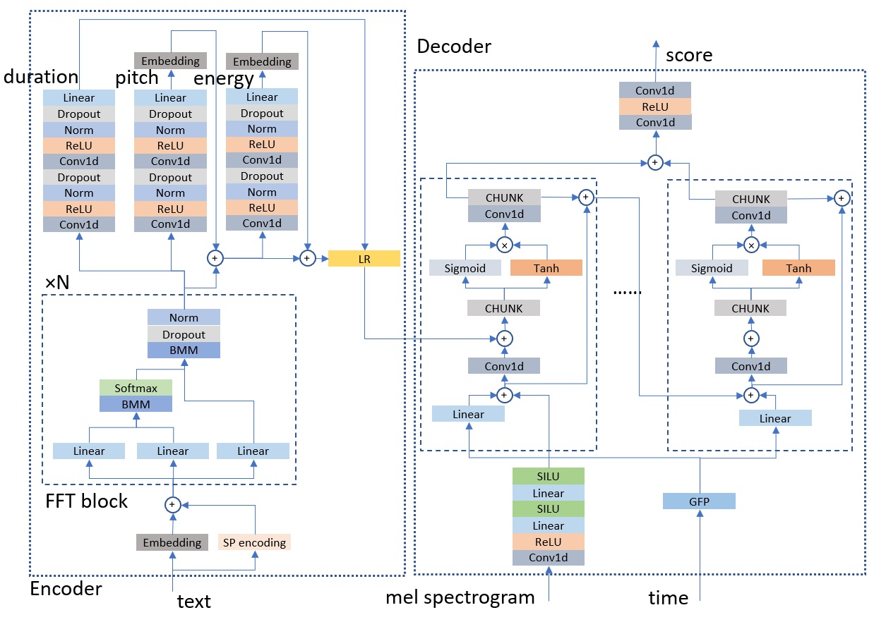

This DEMO mainly introduces ItoTTS and ItoWave, a new generation of speech synthesis technology based on Ito stochastic differential equations.

## Introduction
ItoTTS and ItoWave are designed to solve the problem of generating speech from text. We propose to use the linear Ito stochastic differential equation, under conditional input, such as original text or original sound features (such as speech mel spectrum), to use the Wiener process as a drive to gradually subtract the excess signal from the noise signal, thereby generating realistic corresponding meaningful speech. This process is a lot like Auguste Rodin carved out the thinker from the original natural stone, using carving techniques and methods to gradually remove the superfluous parts from the natural stone. Our method unifies two important aspects in speech synthesis, namely text-to-speech (TTS) and vocoder (vocoder), in one framework, which we call ItoTTS and ItoWave, respectively. This unified framework consists of two stochastic processes with solutions determined by the linear Ito stochastic differential equation and its corresponding reverse-time Ito stochastic differential equation, respectively. These two stochastic processes, especially the reverse stochastic process, can generate mel features (ItoTTS) under the condition of text input; or generate corresponding continuous sounds (ItoWave) under the condition of mel features. The experimental results show that our subjective audience MOS score reaches the highest level in the world.

### Key modules: Score predictor

There are two key modules of our ItoTTS and ItoWave, one is a deep neural network for predicting the log speech probability density gradient value, and the other is a sampling algorithm based on the gradient value and the inverse Ito stochastic differential equation.

Deep Neural Networks for Predicting Log Speech Probability Density Gradient Values

Predictive network structure in ItoTTS

	
<tr>
    <td></td>
  </tr>

Prediction network structure in ItoWave

### Audio samples

#### Short samples
Lyrics:
1. Just a small town girl living in a lonely world
2. She took the midnight train going anywhere
3. It goes on and on and on and on
4. She's got a smile that it seems to me
5. Take a sad song and make it better

<table style='text-align: center;'>
  <tbody>
    <tr>
      <td></td>
      <td>KaraSinger</td>
      <td>3-level</td>
      <td>noCTC</td>
    </tr>
    <tr>
      <td>Sample 1</td>
      <td><audio controls="" style="width: 160px;height: 50px"><source src="./assets/audios/proposed/0.wav" type="audio/wav" /></audio></td>
      <td><audio controls="" style="width: 160px;height: 50px"><source src="./assets/audios/3level/0.wav" type="audio/wav" /></audio></td>
      <td><audio controls="" style="width: 160px;height: 50px"><source src="./assets/audios/noctc/0.wav" type="audio/wav" /></audio></td>
    </tr>
    <tr>
      <td>Sample 2</td>
      <td><audio controls="" style="width: 160px;height: 50px"><source src="./assets/audios/proposed/1.wav" type="audio/wav" /></audio></td>
      <td><audio controls="" style="width: 160px;height: 50px"><source src="./assets/audios/3level/1.wav" type="audio/wav" /></audio></td>
      <td><audio controls="" style="width: 160px;height: 50px"><source src="./assets/audios/noctc/1.wav" type="audio/wav" /></audio></td>
    </tr>
    <tr>
      <td>Sample 3</td>
      <td><audio controls="" style="width: 160px;height: 50px"><source src="./assets/audios/proposed/2.wav" type="audio/wav" /></audio></td>
      <td><audio controls="" style="width: 160px;height: 50px"><source src="./assets/audios/3level/2.wav" type="audio/wav" /></audio></td>
      <td><audio controls="" style="width: 160px;height: 50px"><source src="./assets/audios/noctc/2.wav" type="audio/wav" /></audio></td>
    </tr>
    <tr>
      <td>Sample 4</td>
      <td><audio controls="" style="width: 160px;height: 50px"><source src="./assets/audios/proposed/3.wav" type="audio/wav" /></audio></td>
      <td><audio controls="" style="width: 160px;height: 50px"><source src="./assets/audios/3level/3.wav" type="audio/wav" /></audio></td>
      <td><audio controls="" style="width: 160px;height: 50px"><source src="./assets/audios/noctc/3.wav" type="audio/wav" /></audio></td>
    </tr>
  </tbody>
  <tfoot>
    <tr>
      <td>Sample 5</td>
      <td><audio controls="" style="width: 160px;height: 50px"><source src="./assets/audios/proposed/4.wav" type="audio/wav" /></audio></td>
      <td><audio controls="" style="width: 160px;height: 50px"><source src="./assets/audios/3level/4.wav" type="audio/wav" /></audio></td>
      <td><audio controls="" style="width: 160px;height: 50px"><source src="./assets/audios/noctc/4.wav" type="audio/wav" /></audio></td>
    </tr>
  </tfoot>
</table>

#### Long samples 

<table style='text-align: center;'>
  <tbody>
    <tr>
      <td></td>
      <td>KaraSinger</td>
    </tr>
    <tr>
      <td>Sample 1</td>
      <td><audio controls=""><source src="./assets/audios/long/lyrics1/temp0.wav" type="audio/wav" /></audio></td>
    </tr>
    <tr>
      <td>Sample 2</td>
      <td><audio controls=""><source src="./assets/audios/long/lyrics1/temp1.wav" type="audio/wav" /></audio></td>
    </tr>
    <tr>
      <td>Sample 3</td>
      <td><audio controls=""><source src="./assets/audios/long/lyrics1/temp2.wav" type="audio/wav" /></audio></td>
    </tr>
    <tr>
      <td>Sample 4</td>
      <td><audio controls=""><source src="./assets/audios/long/lyrics1/temp3.wav" type="audio/wav" /></audio></td>
    </tr>
  </tbody>
  <tfoot>
    <tr>
      <td>Sample 5</td>
      <td><audio controls=""><source src="./assets/audios/long/lyrics1/temp4.wav" type="audio/wav" /></audio></td>
    </tr>
  </tfoot>
</table>

Lyrics: \
台灣人工智慧實驗室 (Taiwan AI labs) \
is a privately funded \
research organization based in Taipei. \
Our goal is to leverage \
unique advantages in Taiwan \
to build AI solutions \
to solve the worlds problems.

<table style='text-align: center;'>
  <tbody>
    <tr>
      <td></td>
      <td>KaraSinger</td>
    </tr>
    <tr>
      <td>Sample 1</td>
      <td><audio controls=""><source src="./assets/audios/long/lyrics2/temp0.wav" type="audio/wav" /></audio></td>
    </tr>
    <tr>
      <td>Sample 2</td>
      <td><audio controls=""><source src="./assets/audios/long/lyrics2/temp1.wav" type="audio/wav" /></audio></td>
    </tr>
    <tr>
      <td>Sample 3</td>
      <td><audio controls=""><source src="./assets/audios/long/lyrics2/temp2.wav" type="audio/wav" /></audio></td>
    </tr>
    <tr>
      <td>Sample 4</td>
      <td><audio controls=""><source src="./assets/audios/long/lyrics2/temp3.wav" type="audio/wav" /></audio></td>
    </tr>
  </tbody>
  <tfoot>
    <tr>
      <td>Sample 5</td>
      <td><audio controls=""><source src="./assets/audios/long/lyrics2/temp4.wav" type="audio/wav" /></audio></td>
    </tr>
  </tfoot>
</table>

### Contact 
wu.shoule@protonmail.com, shiziqiang7@gmail.com, 13621160486

